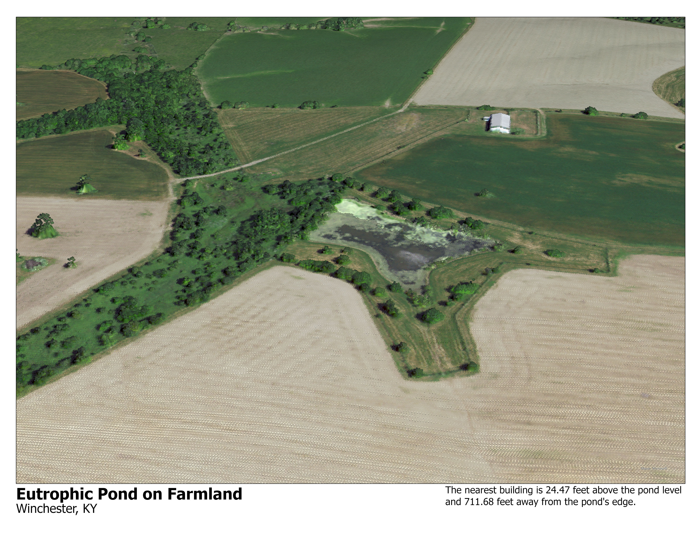

# Lab 05: Visualizing lidar data

## Table of Contents

<!-- TOC -->

- [Lab 05: Visualizing lidar data](#lab-05-visualizing-lidar-data)
    - [Table of Contents](#table-of-contents)
    - [Overview](#overview)
    - [Part I: 3D map of landform (4 pts)](#part-i-3d-map-of-landform-4-pts)
    - [Part II: Animation of landform (4 pts)](#part-ii-animation-of-landform-4-pts)
    - [Publish online (2 pts)](#publish-online-2-pts)
        - [Example page](#example-page)
    - [Submission](#submission)

<!-- /TOC -->

## Overview

In this lab, we'll focus on creating and visualizing a feature and the surface characteristics around the feature. We'll create a 3D map of your selected feature and provide a measurement of the landform. The second part of the lab allows you to animate a fly-through in your area of interest. Your *rrg* repository on GitHub Pages will host the content produced in this lab.

Doing the lesson will produce the map and animation required for this lab, though you will need to download and use the data for a landform or arch in the Red River Gorge. You can easily find lidar data and aerial imagery for any Kentucky location if you run the [explore-lidar.ipynb notebook](../application/explore-lidar.ipynb) before you start. 

## Part I: 3D map (4 pts)

Create a map layout that shows a 3D view of your selected feature. While you have creative freedom in your design, the layout and map must include the following:

* The map should include a colorized point cloud, aerial imagery, and the ground elevation source in the Local Scene should be the bare-earth DEM created from point filtered cloud filtered for ground points.
* The point cloud should be filtered for all points except class codes 7 and 18 (noise).
* Include at least one measurement of your feature. For example, the height of Chimney Top Rock is 160 feet.
* Export the layout as a 200 dpi JPEG, call it 'map.jpg', and save it in this folder.
* Example layout:

## Winchester farm
   
*View of random eutrophic pond on a Winchester farm*

## Part II: Animation of point cloud (4 pts)

Produce an animation that shows your feature with aerial photography and lidar point cloud in ArcGIS Pro. Requirements:

* Start with the 3D map you created in Part I and use the same layers.
* Video should be between 30 seconds and 1 minute in length.
* It should rotate around your feature or zoom into the feature.
* For best results, make sure the frame rate doesn't exceed 10 frames per second.
* Export either an MP4 video or animated GIF. 
  * An MP4 video should be hosted on a video streaming service such as YouTube and Vimeo.
  * A GIF can be hosted in your repo, but it cannot be over 100 MB.
* Example: [Hiking up to Indian arch](https://www.youtube.com/watch?v=nFV8ftGN0aM)
* Create a screenshot of the video, call it 'animation.jpg', and save it in this folder.

## Publish content in this document (2 pts)

The final submission must fulfill the following requirements:

* Edit the Markdown section below to include the map and video created in the above parts.

## My Feature Name

     
*Caption of Map*

     
*[Name of the link for video](https://www.youtube.com/watch?v=nFV8ftGN0aM)*

## Submission

* In Canvas, submit the GitHub.com URL to this repository.

